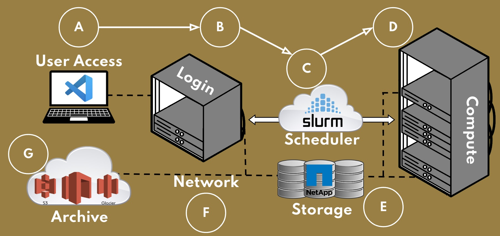

.. _sec.qs0:

================================
Quickstart 0: Connecting to DEAC
================================

.. contents::
   :depth: 2
..

.. #############################################################################
.. #############################################################################
.. #############################################################################
.. #############################################################################

.. _sec.qs0:cluster_overview:

DEAC Cluster Overview
=====================



    General Illustration of Cluster Architecture

When you log in to the Cluster, you are actually logging into a *head node* that
acts as a gateway to other cluster resources. A head node is configured to
submit jobs to the *scheduler*. In general, when "logging in to the cluster" is
mentioned, the act of logging into a head node is how you do it.

A head node is nothing more than a system configured to act as the midway point
between you and the compute resources. When you are on a head node, you are not
actually running or working on the compute resources. You should **NEVER** run
computational programs on the head node itself; thus, any programs you want to
run on the cluster should not be executed directly on the head node. They should
be run and tested using the scheduler with the tools provided on the head node.
Usage of the head node is restricted to managing and viewing your data.

The head nodes are configured in a similar way to the compute nodes, in that all
of the installed software and data paths are present. This allows you to verify
your job functionality before submitting to the scheduler. You should never need
to access the individual compute nodes directly, and instead rely on the head
node and the tools it provides to submit jobs to the cluster, monitor them, and
then retrieve and view their results.

.. _sec.qs0:cluster_headnodes:

DEAC Headnodes
==============

The DEAC Cluster has three head nodes:

* **gemini.deac.wfu.edu** (WFU College and most Schools)
* **pegasus.deac.wfu.edu** (WFU College and most Schools)
* **hydra.deac.wfu.edu** (WFU School of Medicine ONLY)

These systems all have at least 16 cores and 128GB of RAM each.

.. _sec.qs0:access:

Access
======

To log in to the head nodes, users must use the SSH protocol.
Login can only be achieved after a `cluster account
request <https://help.wfu.edu/support/catalog/items/123>`__ has
been submitted. Do NOT use your Desktop or Laptop account/password to
access these nodes!

*Login to the DEAC headnodes is restricted to Wake Forest Networks
only*! This is a security precaution to prohibit unauthorized access and
bot login attempts. If any user is attempting to login via SSH off
campus, they must have an `established VPN
connection </https://is.wfu.edu/services/vpn/>`__ to vpn.wfu.edu! To
make this VPN connection, one SHOULD use their Desktop/Laptop
account/password. Once the VPN connection is made, SSH to the DEAC
headnodes and user your cluster account/password as you normally would!

External Collaborators
======================

If you wish to collaborate with non-WFU personnel, please have them
email deac-help@wfu.edu and we will create a guest account for them to
be able to VPN in. More detailed info to come soon.

.. #############################################################################
.. #############################################################################
.. #############################################################################
.. #############################################################################

Required Software
=================

An SSH client. SSH (Secure SHell) gives you an encrypted terminal
session to the head nodes.
`PuTTY <http://www.chiark.greenend.org.uk/~sgtatham/putty/>`__ should be
installed on your WFU issued laptop. If it is not, you may download it
from `PuTTY's download
site <http://www.chiark.greenend.org.uk/~sgtatham/putty/download.html>`__.

-  **NOTE:** Be sure to download the "Windows installer" binary so that
   it will do all the dirty work for you.

Recommended Software for Remote Display
=======================================

An X11 Server. Opening graphical windows from the cluster requires
Windows to support the X11 protocol. An open source X11 client,
`Xming <http://www.straightrunning.com/XmingNotes/>`__, is available for
download.

Windows Configuration Steps
===========================

-  In PuTTY, the "X11 Forwarding" setting must be checked on (see image
   below) -- it's under Connection -> SSH -> X11:

`thumb|200px|PuTTY setting for X11
Forwarding </File:Putty_x11_forwarding.png>`__

-  For basic X11 forwarding, use
   `Xming <http://www.straightrunning.com/XmingNotes/>`__\  [1]_
-  For advanced X11 forwarding, use
   `Cygwin/X <https://x.cygwin.com/docs/ug/cygwin-x-ug.html>`__\  [2]_\ `Cygwin/X <https://x.cygwin.com/docs/ug/cygwin-x-ug.html>`__\ 

`thumb|200px|Running Xming from the Windows Start
menu </File:Windows_start_xming.png>`__

More Conveniences
-----------------

-  `PuTTY Session Manager <http://puttysm.sourceforge.net/>`__ -
   displays a list of all saved sessions in order to quickly launch them

`right|thumb|200px|Windows desktop showing PuTTY Session
Manager </File:Desktop_putty_sm.png>`__

See Also
========

-  :ref:`SSH Section <sec.qs0:ssh>` -- more details on
   using PuTTY on Windows, including some information on the PuTTY
   Sessions Manager which keeps a list of saved sessions always
   available

References
==========

.. raw:: html

   <references/>

.. [1]
   `Xming <http://www.straightrunning.com/XmingNotes/>`__

.. [2]

.. #############################################################################
.. #############################################################################
.. #############################################################################
.. #############################################################################

.. _sec.qs0:ssh:

SSH
===

**SSH** provides an encrypted terminal session from one computer to another: all
commands that you type and all output from the remote machine are scrambled. It
normally communicates over port 22.

Linux/Unix/Mac OS X
-------------------

* Start a terminal program
* Type the command -- note that that is an uppercase "Y", not lowercase:

.. code:: bash

    $ ssh -A -Y username@<headnode.deac>

* If this is your first time connecting, you will get a warning::

    The authenticity of host 'headnode.deac (152.17.36.129)' can't be established.
    RSA key fingerprint is  13:75:40:c7:fe:dd:f2:83:63:9a:6a:f6:53:77:5b:52
    Are you sure you want to continue connecting (yes/no)? yes
    Warning: Permanently added '<headnode.deac>' (RSA) to the list of known hosts.

* At the :code:`Are you sure you want to continue connecting?` prompt, you must
  type in the full word "yes".
* The :code:`-Y` option allows for *X11 forwarding* so that GUI-based
  applications can be displayed on the local machine.

Windows
-------

You will need the `PuTTY <https://www.chiark.greenend.org.uk/~sgtatham/putty/>`_
program. Using PuTTY is more complicated than using ssh in Linux. You will need
to set up "profiles" for each host you wish to connect to.

* PuTTY is installed on your WFU laptop as part of the standard load.
* Otherwise, you may `download it
  <https://www.chiark.greenend.org.uk/~sgtatham/putty/download.html>`_ (Choose
  putty.exe).
* The first time you run PuTTY, you will see:

.. image:: images/Putty_01.png

* To create a new profile:

    1. Enter a hostname or IP address in the "Host Name (or IP Address)" box
       near the top of the window; make sure the "SSH" button is selected
    2. Enter the same host name in the empty box right below "Saved Sessions"
    3. In the left sidebar (Category:), click on "Data" in the "Connection"
       category -- you will see a new form on the right
    4. In the "Login Details" section, enter your own username in "Auto-login
       username"

    .. image:: images/Putty_02_1.png

    5. Then, click back on the "Session" category in the left sidebar, and click
       the "Save" button

* To connect to the host, double-click the saved session name.
* If it is the first time you are logging into a headnode from this Windows
  machine, you will see a "security alert" -- just click "Yes" to continue
  connecting:

.. image:: images/Putty_04.png

For more information, including getting GUI applications from the cluster to
display on your Windows computer, see :doc:`Using the Cluster from a Windows
system <cluster/Using_from_Windows>`.

See Also
--------

Training Video
````````````````

* DEAC Login with PuTTY Training Video

.. raw:: html

    <div style="text-align: center; margin-bottom: 2em;">
    <iframe width="100%" height="480" src="https://www.youtube.com/embed/3rl7otU9Evw?rel=0" frameborder="0" allow="autoplay; encrypted-media" allowfullscreen></iframe>
    </div>

Helpful Links
`````````````

* `SSH Tutorial for Linux <https://support.suso.com/supki/SSH_Tutorial_for_Linux>`_
* `Public key-based authentication for passwordless login <https://sial.org/howto/openssh/publickey-auth>`_

.. #############################################################################
.. #############################################################################
.. #############################################################################
.. #############################################################################

Your
cluster login information is completely separate from both the Wake
Forest campus login, and the WFUBMC login.

When your account is first created, you are given a temporary password
which is only good for 14 days. You should immediately create your own
password. Once that initial 14-day period is up, we will have to set
another temporary password.

When you create your own password, it is good for 180 days.

How to Change Password
======================

-  Use the **``passwd``** command on any of the head nodes: Type
   "``passwd``" and you will be prompted to enter your currently set
   password, followed by a new one (twice for confirmation).

Forgotten Passwords
===================

-  Send email to deac-help@wfu.edu to request a password reset. Once
   reset, the temporary password is only good for 14 days.

Expired Passwords
=================

-  Send email to deac-help@wfu.edu to request a password reset.

Good Passwords
==============

-  Bad passwords are based actual words or related topics and are easily
   guessable; for example: “\ ``wakeforest``\ ”. They should **not** be
   used.
-  Good passwords will have 8 or more characters
-  Good passwords will have a mix of lower- and upper-case letters,
   numbers, and punctuation symbols
-  You can generate a random password with the **apg** command:

``    apg -M NCS -m 8 -t``

Important Note
==============

We will **never ever** ask for your password for any reason.

.. #############################################################################
.. #############################################################################
.. #############################################################################
.. #############################################################################
