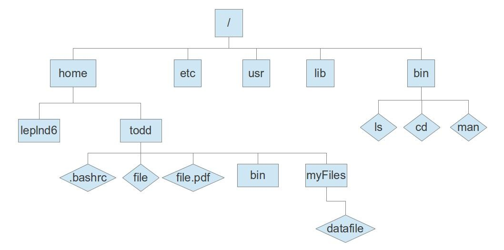

.. _sec.qs1:

==========================
Quickstart 1: Linux Primer
==========================

.. contents::
   :depth: 3
..

.. #############################################################################
.. #############################################################################
.. #############################################################################
.. #############################################################################

Linux is a free operating system (OS) based on open source development. This
means that the source code (mostly written in C) is freely available for anyone
to read, modify, and share. As a consequence of this model, Linux and other
UNIX-derived operating systems rely on a series of discrete tools working in
tandem, and not on a single integrated graphical layer. This makes Linux very
powerful, with much of that power coming from using those tools together;
however, mastering each of the basic tools separately is an important first
step. This guide isn't intended to teach you everything about each tool, but to
provide a general introduction to the command line and show you a little of what
Linux can do.

This primer will specifically cover Linux from the command line perspective, as
that is the working environment on the DEAC Cluster. If you use Windows with an
SSH tool to log in to the cluster, this is the only flavor of Linux you will be
exposed to. If you have a local Linux installation, macOS, or other UNIX
derivative, almost everything said here should apply to any *terminal*
application you may have locally available.

.. #############################################################################
.. #############################################################################
.. #############################################################################
.. #############################################################################

.. _sec.qs1.command_prompt:

The Command Prompt
==================

When you first log into the cluster, you will be greeted by the command prompt:

.. code-block:: none

    ******************************************************************************
    *   Wake Forest University  Distributed Environment for Academic Computing   *
    *                                                                            *
    * __/\\\\\\\\\\\_____/\\\\\\\\\\\\\____/\\\\\\\\___________/\\\\\\\_________ *
    * __\/\\\///////\\\__\/\\\/////////___/\\\\\\\\\\\\______/\\\//////_________ *
    * ___\/\\\_____\//\\\_\/\\\___________/\\\////////\\\___/\\\/_______________ *
    * ____\/\\\______\/\\\_\/\\\\\\\\\____\/\\\______\/\\\__/\\\________________ *
    * _____\/\\\______\/\\\_\/\\\/////_____\/\\\\\\\\\\\\\\_\/\\\_______________ *
    * ______\/\\\______\/\\\_\/\\\__________\/\\\////////\\\_\//\\\_____________ *
    * _______\/\\\______/\\\__\/\\\__________\/\\\______\/\\\__\///\\\__________ *
    * ________\/\\\\\\\\\\\/___\/\\\\\\\\\\\\\\/\\\______\/\\\____\////\\\\\\\__ *
    * _________\///////////_____\/////////////_\///_______\///________\///////__ *
    *                                                                            *
    *  Unauthorized use is STRICTLY PROHIBITED and we maintain all rights to     *
    *  University related or legal actions associated with such access.          *
    *                                                                            *
    *  Please refer to http://www.deac.wfu.edu/ for more information regarding   *
    *  usage policies, supporting documentation, and methods for obtaining       *
    *  support for issues regarding the DEAC HPC Cluster environment.            *
    *                                                                            *
    ******************************************************************************

    System: gemini.deac.wfu.edu, Uptime: 205 days

    [USER@gemini ~]$

The command prompt accepts many commands, and also has its own logic, syntax,
and many other features. You can write your first script on the command line by
giving the command ``echo 'Hello world!'``. Another quick example: try the
command ``echo $((4+5))``; yes, you can do math directly on the command line!

There are several command line environments in existence. Bash is the `Bourne
Again Shell <https://www.gnu.org/software/bash>`_ (based on sh, the Bourne
shell) and is part of the `GNU Project <https://www.gnu.org/home.html>`_; it is
the *de facto* command processor for Linux. By default, all user accounts are
set to use Bash unless otherwise noted; you can verify this by issuing the
``echo $0`` command. It should return your shell name, ``bash``, but could also
``tcsh``, ``csh``, ``zsh``, ``fish``, amongst others, if you requested that.

.. #############################################################################
.. #############################################################################
.. #############################################################################
.. #############################################################################

.. _sec.qs1.files_dirs:

Navigating the Filesystem and Working with Files
================================================

In Linux (and other UNIX-like OSs), files are organized in something called the
directory tree. The "root" of the tree is called ``/``, and is also known as the
root directory. A basic Linux filesystem is typically laid out like this:

   A schematic of the Linux directory tree.

.. #############################################################################
.. #############################################################################
.. #############################################################################
.. #############################################################################

.. _sec.qs1.files_dirs.paths:

Naming
------

In Linux (and other UNIX-like OSs), files and paths are case sensitive. When 
creating or trying to access a path, upper and lower case letters DO matter. A
file called "CriticalData" would be different from one called "criticaldata".
Also note that file extensions (like .txt or .dat) are not required; they are 
simply used to make files more "human readable". Use of spaces and special
characters (example: !@#$%^&*) should also be avoided. To seperate words, users
should utilize underscores (_), dashes (-), or type in camelCase to make names
easier to read.

Paths
-----

Every location on the filesystem is represented by a *path*. These paths are
simply a representation of where a given directory or file lives within the
Linux filesystem structure, as mentioned in the previous section. Here is an
example path:

.. code-block:: none

    /opt/work/data_analysis/my_script.sh

This path indicates the location of a file ``my_script.sh``. All paths are read
from left to right, so we know that we must traverse the ``opt`` directory, then
the ``work`` subdirectory, then the ``data_analysis`` subdirectory, to get to
it. From the previous section, you know that the leading ``/`` is the root of
the filesystem, so this path tells you exactly where your file is with respect
to that. This type of path is called an **absolute path**, because there is no
ambiguity as to the location of the directory or file; this path will hold true
no matter where you are on the filesystem. All absolute paths must start with
``/``, which is consistent with what we have said up until this point. These
paths are very safe to use, but can be long to type and are not intended to be
flexible.

Look at this other example path:

.. code-block:: none

    ../../test2/LiBrO2/

This path differs from the previous example in that it does not start with
``/``, meaning that it does not reference the root of the filesystem. The dot
symbols are Linux shorthand for specific directories; namely, ``.`` is your
current directory, and ``..`` is the parent directory. Thus, ``../`` is
equivalent to saying "go up one directory", and likewise ``../../`` tells you to
go up two directories to get to your destination. You should be able to see an
inherent "problem" with this path: from where do you have to start before going
up two directories to get to the ``test2/LiBrO2/`` directory? This is why these
paths are called **relative paths**; they are relative to some starting point
that may or may not be obvious. The benefit of using relative paths is that they
are a lot quicker to type. The can also be useful if you are working within an
entire set of directories that always stay in the same places relative to each
other; relative paths are typically more versatile than absolute paths.

.. #############################################################################
.. #############################################################################
.. #############################################################################
.. #############################################################################

.. _sec.qs1.files_dirs.paths.summary:

Summary
+++++++

1. **All files and directories** on the Linux filesystem can be represented with
   a *path*. The sooner you begin to think in terms of paths, the easier it will
   be to manage all your files and tasks.
2. **Absolute paths**: paths that are totally unambiguous, always start with
   ``/`` because they always reference the root of the filesystem. Very safe to
   use, but can be long and inflexible.
3. **Relative paths**: paths that are relative to some location. Convenient to
   type and more flexible, but can very easily lead to confusing/inconsistent
   behavior.

.. #############################################################################
.. #############################################################################
.. #############################################################################
.. #############################################################################

.. _sec.qs1.files_dirs.dirs:

Moving Around
-------------

Your home directory is always in ``/home/YOUR_USERNAME``, where
``YOUR_USERNAME`` is your username. This directory is where various important
files will live, and where you will land on the cluster after connecting. This
special directory also has another name, ``~``, the tilde symbol, which is just
a shortcut that the Linux shell will expand to mean "your home directory".
Either of these two options can be used to refer to your home directory.

Based on the information from the preceding section, you should immediately
recognize that ``/home/YOUR_USERNAME`` is an **absolute path**. But what about
``~``? It seems counterintuitive to think of it as a **relative path**, because
it is not relative to any other location and it refers uniquely to your home
directory, right? Well, that's not entirely true -- it does not **uniquely**
refer to your home directory, because every user has their own home directory,
and each one can be referred to as ``~`` by that specific user! For instance, if
someone tells you to find a file that they have in ``~/scratch``, you would not
necessarily be able to find it; conversely, if they tell you it is in
``/home/elsa/scratch`` (an absolute path) you now have an unambiguous location
to look in.

Try out some basic commands to navigate and manipulate directories. You can use
the ``cd`` (*change directory*) command to move around the filesystem, and you
can use the ``pwd`` (print working directory) command to get a printout of what
directory you are currently in. If you execute ``cd`` without an argument you
will be returned to your home directory;``cd ~`` has the exact same
functionality. Use the command ``pwd`` to print out your current directory, so
it should output ``/home/YOUR_USERNAME``. Now try ``cd ..`` This will move you
up one directory (towards root, ``/``) in the directory tree, so you should now
be in the ``/home`` directory; verify this with the ``pwd`` command.

.. #############################################################################
.. #############################################################################
.. #############################################################################
.. #############################################################################

.. _sec.qs1.files_dirs.dirs.summary:

Summary
+++++++

1. Your **home directory** is always at ``/home/YOUR_USERNAME``, but you can
   also use the tilde symbol ``~`` as an equivalent shortcut.
2. Change directory using the ``cd`` command, like ``cd some/directory``.
3. Print the path of your current directory with ``pwd`` so you don't get lost.

.. #############################################################################
.. #############################################################################
.. #############################################################################
.. #############################################################################

.. _sec.qs1.files_dirs.files:

First Commands with Files and Directories
-----------------------------------------

The ``ls`` command will provide you with a list of files and directories in your
current directory. The ``ls`` command has a lot of options that can alter its
output. For instance, try both ``ls ~`` and ``ls -a ~``; both of these will list
the contents of your home directory, but the latter has the *all* option passed
to it. You should see that the second command lists a few more files and
directories that all start with a ``.`` in their names; these are *hidden* files
and directories. Thus, beginning a file or directory name with a ``.`` in Linux
makes the directory or file hidden. Hidden files and directories are no
different than their regular counterparts, but are typically used for
configuration files and application settings.

Now, try out some basic commands for manipulating and viewing files:

1. Go back to your home directory with the command ``cd ~``.
2. Create an empty hidden file with the command ``touch .myhiddenfile`` and
   verify the existence of this file using ``ls`` and ``ls -a``.
3. Write some text to that file using the command ``echo "This is some data for
   the file, llama" > .myhiddenfile``.
4. View the contents of the file with the command ``cat .myhiddenfile``.
5. Use ``grep`` to search through all the files in the current directory for the
   term "llama" with the command ``grep "llama" *``.

You just did a lot, so let's review. The ``touch`` command simply creates an
empty file with whatever name you provide it. You probably won't use this very
often, but it can be useful to quickly create some files as placeholders, for
example.

The ``echo`` command literally prints whatever string you give it; for instance,
``echo Hello World`` will simply print ``Hello World`` to the screen. The
greater-than ``>`` symbol is called a *redirect*; in this case, we are
redirecting the output of the ``echo`` command to our file, ``.myhiddenfile``.
This effectively writes the text to the file. This is a very basic method of
writing files that you probably won't use to write and edit your own files, but
is very common for saving logs and other screen output.

The ``cat`` command stands for *concatenate*, and it is the quickest way to view
the contents of a file. Running the command on a file simple prints the entire
contents of the file to the screen. This is a great way to view small files with
a few lines, but you definitely don't want to do this with a file with thousands
of lines!

Lastly, the ``grep`` command allows you to search through a file or files for a
specific string. The ``*`` character is a wildcard that matches all files, so
this ``grep`` command was instructed to look in every file in the directory for
the ``llama`` string. You could also have give a specific filename, like ``grep
"llama" .myhiddenfile``. The ``grep`` command is a very powerful tool that you
will use on a daily basis!

But what about directories? Use the command ``mkdir ~/testcase`` to make a
subdirectory called ``testcase`` within your home directory. Now use the command
``cd ~/testcase`` to *change directory* into the new directory. You can then
create more subdirectories, add files to your new directory, or go back to the
parent directory with ``cd ..``.

.. #############################################################################
.. #############################################################################
.. #############################################################################
.. #############################################################################

.. _sec.qs1.files_dirs.files.summary:

Summary
+++++++

1. ``ls`` lists the contents of the current directory; ``ls -a`` lists *all* the
   files including hidden files and directories.
2. **Hidden files and directories** always start with a ``.`` in their name, but
   are otherwise the same as their non-hidden counterparts.
3. ``echo`` prints a string to the screen, like ``echo "Hello world"``.
4. ``grep`` searches for a string within a file or files, like ``grep "Hello"
   myfile``.
5. You can make a new directory with ``mkdir``, like ``mkdir new_dir``.

.. #############################################################################
.. #############################################################################
.. #############################################################################
.. #############################################################################

.. _sec.qs1.files_dirs.moving:

Moving, Copying, and Removing
-----------------------------

You can now navigate the filesystem and create new files and directories. Your
next steps will be to move, duplicate, rename, and delete objects.

Moving files and directories is done with the ``mv`` command, like ``mv oldfile
newfile``. This also doubles as a rename feature, which makes sense if you think
about it like *moving a file to its new name*. You can move files from anywhere
on the filesystem to anywhere else, like ``mv /path/to/some/file
~/scratch/new_file``. You can use both relative or absolute paths to indicate
the source and the destination of your file.

Copying files and directories can be carried out with a very similar procedure;
``cp origfile newfile`` will create a copy of ``origfile`` named ``newfile``.
Directories require a small modification to the command: ``cp -r origdir
newdir``, where the ``-r`` option stands for recursive, as it will enter the
directory and all subdirectories recursively.

Lastly, the remove command, ``rm``, can be used to delete files and directories.
Similar to the ``cp`` command, ``rm`` will delete files and ``rm -r`` will
*recursively* delete directories. You can delete any number of files at a time,
like ``rm file1 file2 file3``, and you can also use wildcards like ``rm *.jpg``
which will delete all ``.jpg`` files. **NOTE: the remove command is permanent
and irreversible!** There is no "Recycle Bin" or other safeguard against
permanent deletion. When you remove a file or directory with the ``rm`` command,
it's gone forever.

.. #############################################################################
.. #############################################################################
.. #############################################################################
.. #############################################################################

.. _sec.qs1.files_dirs.moving.summary:

Summary
+++++++

1. Move/rename files and directories with the **move** command, like ``mv
   oldfile newfile``.
2. Copy files and directories with the **copy** command, like ``cp origfile
   newfile`` for files and ``cp -r origdir newdir`` for directories.
3. Remove files and directories with the **remove** command, like ``rm file1``
   for files and ``rm -r dir1/`` for directories.

.. #############################################################################
.. #############################################################################
.. #############################################################################
.. #############################################################################

.. _sec.qs1.files_dirs.pipes:

Pipes
-----

**Pipes** are used for routing the output from one command to another. They are
represented by the vertical line symbol ``|``. For instance, you could do ``ls |
grep "manuscript.pdf"`` to find a specific file within a directory with many
files. Using pipes, you can chain commands together to get exactly the output
you want.

``xargs`` is another powerful and more advanced command for passing the output
between commands. For example, the command ``ls | xargs -L 4 echo`` will display
the output of ``ls`` with 4 files/directories on each line.

.. #############################################################################
.. #############################################################################
.. #############################################################################
.. #############################################################################

.. _sec.qs1.customizing.adventure:

Practice, Practice, Practice
============================

The best way to learn all of these commands? Start using them on the cluster!
They will soon become second nature to you. We've covered the basics on
navigating the filesystem and manipulating your files, and you've learned how to
work with some essential commands that have an almost infinite number of
use-cases. They may seem a bit counterintuitive at first, but you'll appreciate
the flexibility when you start developing your projects on the cluster.

This guide is only a (very) brief introduction to Linux! There is obviously a
lot more that Linux has to offer, so continue reading on if you want to learn
more about customizing your work environment. We also have a more extensive
:ref:`sec.linux`.

Don't be afraid to do your own research and follow along with other great
tutorials that are available online; some are listed below in
:ref:`sec.qs1.extra_reading`. Because Linux is free and open source software
(FOSS), all users are encouraged to share their knowledge! Search online to
learn more tips and tricks from other users that may be working on similar
problems, that can save you a lot of time in the long run.

Besides what is written above, you can always consult more complete
documentation on a any given command (``MyCommand``) by consulting the manual
pages (just type ``man MyCommand``), or by checking the help summary
(``MyCommand --help``), or by doing your own web search. To search the manual
pages for a command with a desired feature (``MyFeature``) use ``man -k
MyFeature`` or ``apropos MyFeature``.

.. #############################################################################
.. #############################################################################
.. #############################################################################
.. #############################################################################

.. _sec.qs1.customizing:

Advanced: Customizing Your Experience
=====================================

You have lots of control over your command line environment. In your home
directory there will be a file called ``.bashrc``; this is a (hidden)
configuration file that defines many of the parameters that control your local
shell environment. Some of these parameters can be made into *environment
variables*, that are variables that can be read directly from your command line
programs. This file is not special, it is simply a series of commands that get
run every time you login. You can override them by issuing new commands at the
command line that redefine these variables.

.. #############################################################################
.. #############################################################################
.. #############################################################################
.. #############################################################################

.. _sec.qs1.customizing.scripts:

Shell Configuration Files
-------------------------

There are a few configuration files that control the behavior of your local
shell environment:

* ``~/.bashrc``
* ``~/.bash_profile``
* ``~/.profile``
* ``~/.bash_login``
* ``~/.bash_logout``

Typically, you will only ever need to modify the ``~/.bashrc`` file when
customizing your environment. Not all of these files may affect your particular
shell, as they depend on whether your session is interactive or not and whether
it is a login shell. You can find a `highly technical description of these files
in the Bash Reference Manual
<https://www.gnu.org/software/bash/manual/bash.html#Bash-Startup-Files>`_.

.. #############################################################################
.. #############################################################################
.. #############################################################################
.. #############################################################################

.. _sec.qs1.customizing.command_history:

Command History
---------------

Your shell will automatically keep a list of all previously executed command,
and you can use that history to repeat previous commands. There are several days
to accomplish this:

* Navigate through your recent history by using the up and down arrow keys.
* You can do a fine search of your entire history by pressing ``ctrl + r`` on
  your keyboard, which opens the reverse history prompt. Simply type in a few
  letters and you will get a relevant match. Press ``ctrl + r`` again to cycle
  through the matches.
* The ``history`` command will print your entire history to the screen. This is
  useful if you want to view many commands simultaneously or filter out all
  commands that match a certain query.

.. #############################################################################
.. #############################################################################
.. #############################################################################
.. #############################################################################

.. _sec.qs1.customizing.environment_variable:

Environment Variables
---------------------

*Environment variables* are variables that can be read from within your shell
environment. These can be any number of things, from frequently used paths to
entire commands. The syntax for defining environment variables is:

.. code-block:: bash

    export RESEARCHPATH='/deac/some/long/path'              # for long paths
    export SPECIAL_ENV="some_string"                        # can be any string
    export VERY_SPECIAL_ENV="another_string:${SPECIAL_ENV}" # these variables can be
                                                            # concatenated with other variables

These lines can be placed in your ``~/.bashrc`` file for them to take persistent
effect in your environment every time you log in. Likewise, they could also be
directly executed on the command line, only taking effect in your current
logged-in session.

There are a few pre-defined environment variables that you should be aware of.
Principal amongst them is your ``$PATH``. The ``$PATH`` variable tells the shell
where to look for executables, or programs to run. A typical ``$PATH`` setting
includes ``/bin``, ``/usr/bin/``, and maybe a few others. In fact, all of the
commands that you have used up to this point (``ls``, ``cd``, ``cp``, etc.) are
all executable files that live inside of those directories.

If your ``$PATH`` variable was ever cleared, you would no longer be able to
issue simple commands like ``cd`` or ``ls`` because your shell would no longer
know where to look to find them! However, you can always execute a command by
using its absolute path, like ``/bin/ls`` or ``/bin/cd``.

If you write your own scripts or programs that you want to execute, you can put
them in ``~/bin`` and add that to your ``$PATH``; this would save you the
trouble of having to type out the full path to each of your programs when
executing.

.. #############################################################################
.. #############################################################################
.. #############################################################################
.. #############################################################################

.. _sec.qs1.customizing.aliases:

Aliases
-------

You can set *aliases* for commands that you perform often. Here are some common
examples:

.. code-block:: bash

    alias ls='ls -FC --color=auto'  # nice colorized ls output
    alias ll='ls -l'                # ls in list format
    alias la='ll -a'                # ls in list format with hidden files
    alias rm='rm -i'                # confirms before deleting, override with -f
    alias research='cd /deac/some/long/research/path' # for jumping to a long path

Like the environment variables from the previous section, these can be inserted
in your ``~/.bashrc`` file. After logging out and back in, you could simply type
``research`` and it would execute ``cd /deac/some/long/research/path``.

.. #############################################################################
.. #############################################################################
.. #############################################################################
.. #############################################################################

.. _sec.qs1.customizing.more_commands:

Functions
---------

You can create some very advanced customizations by using **functions**. These
allow you to combine commands and reuse them in flexible ways. This is useful
when you find yourself repeating a sequence of commands over and over again. For
instance, perhaps you have a very specific for formatting your data files;
writing a function for this would allow you to repeat your procedure on any file
with just a single command. You can define a function within your ``~/.bashrc``
file like this:

.. code-block:: bash

    function extract()      # Handy Extract Program.
        {
             if [ -f $1 ] ; then
                 case $1 in
                  *.tar.bz2)   tar xvjf $1     ;;
                  *.tar.gz)    tar xvzf $1     ;;
                  *.bz2)       bunzip2 $1      ;;
                  *.rar)       unrar x $1      ;;
                  *.gz)        gunzip $1       ;;
                  *.tar)       tar xvf $1      ;;
                  *.tbz2)      tar xvjf $1     ;;
                  *.tgz)       tar xvzf $1     ;;
                  *.zip)       unzip $1        ;;
                  *.Z)         uncompress $1   ;;
                  *.7z)        7z x $1         ;;
                  *)           echo "'$1' cannot be extracted via >extract<" ;;
               esac
          else
                 echo "'$1' is not a valid file"
          fi
        }

This particular example function is for extracting compressed files. With this
function in place, you would know be able to run the ``extract`` command, like
``extract compressed_file.zip``. The function detects what type of compressed
file you have, and will automatically choose the correct command to extract it.

.. #############################################################################
.. #############################################################################
.. #############################################################################
.. #############################################################################

.. _sec.qs1.extra_reading:

Extra Reading
=============

* Our own :ref:`sec.linux`
* The `Ubuntu Linux command line for beginners tutorial
  <https://ubuntu.com/tutorials/command-line-for-beginners>`_
* `Ryan's Tutorials tutorial on the Linux command line
  <https://ryanstutorials.net/linuxtutorial>`_
* `Ryan's Tutorials tutorial on bash scripting
  <https://ryanstutorials.net/bash-scripting-tutorial>`_
* The `Bash Reference Manual
  <https://www.gnu.org/software/bash/manual/bash.html>`_

You can also view :download:`some classic slides by the HPC Team
<images/Linux_intro.pdf>` offered to DEAC users on learning Linux.

.. #############################################################################
.. #############################################################################
.. #############################################################################
.. #############################################################################
