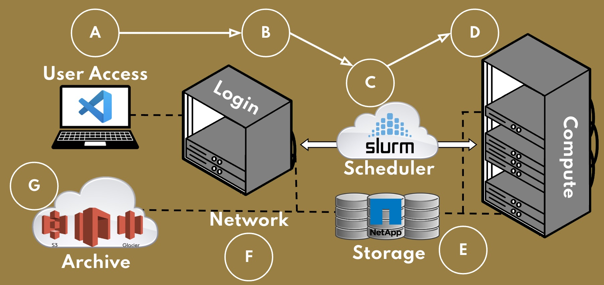

.. _sec.cluster_overview:

====================
General HPC Overview
====================

.. contents::
   :depth: 3
..

There is a great deal of history that can be told about how Linux-based,
Beowulf style clusters originated and evolved over the years (starting
from 1994 [1]_ until the present). For those interested in the history
and a somewhat technical view, you can visit the historical "HOWTO"
document at:
http://ibiblio.org/pub/Linux/docs/HOWTO/archive/Beowulf-HOWTO.html

The goal of this article is simply to familiarize you with Beowulf
clusters, the relevant terminology, and to help ease you into
understanding how they work.

.. _sec.cluster_overview.basics:

The Basic Terminology
=====================

High Performance Computing, or HPC, is a technology that allows people to process huge amounts of data and solve large, complex, and parallel problems at very high speeds. The technology upon which HPC operates is referred to as a Cluster, or Supercomputer, which is a series of commercially available hardware, configured to efficiently work together as a singular system.

The components often found in an HPC Cluster are:

*  Node :
	* Generic term used to describe a system or server that is configured as part of a Cluster.
*  Login Nodes :
	* Server(s) that users interact with directly in order to use the system.
*  Compute Nodes :
	* Any number of servers where the majority of computations are executed and majority of resources (CPU, RAM) are found
*  GPU Nodes :
	* Any number of servers where specific computations requiring GPU resources are executed.
*  Persistent Storage :
	* Common set of home and research directories that are available on all Cluster Nodes to store data.
*  Common system image :
	* The operating system installed on cluster nodes, almost always Linux.
*  Resource Manager :
	* Software that tracks resources (processors, memory, node attributes) availability
*  Job Scheduler :
	* Software that allocates user's computational tasks (a "job") to be executed on requested resources based on pre-established policies and cluster usage.
*  Parallel Programming Middleware :
	* OpenMP multi-threading capable compilers and Message Passing Interface (MPI) library support.

.. _sec.cluster_overview.deacbasics:

The Basics on DEAC
==================

    General Illustration of DEAC Cluster Architecture

DEAC Login Nodes
----------------

The DEAC Cluster has three login nodes:

* **apollo.deac.wfu.edu** (Modern AMD Architecture)
* **artemis.deac.wfu.edu** (Modern AMD Architecture)
* **gemini.deac.wfu.edu** (Legacy Intel Architecture)

DEAC Compute Nodes
------------------

DEAC Cluster Compute nodes are refreshed annually and targetted for retirement after 5 years. This annual refresh means our node types are often not all the same, and could have different number of cores, memory, scratch space, or even CPU Architecture. When requesting large amount of resources, this could limit what nodes are able to meet your request. Changes in CPU Architecture may also cause variance in job run times, depending on the age of the node used.

For more information, look at the :ref:<sec.hardware.physical.compute> section on our :ref:<sec.hardware> page, or feel free to contact the HPC Team.

DEAC GPU Nodes
--------------

DEAC Cluster GPU nodes are refreshed as required based upon user demand. Each node is targetted for retirement after 5 years, but the GPU cards within may be used for longer, depending upon their relevance. Similar to our Compute Nodes, each GPU Node may have a varying number of resources, including GPU Card type and number available. When requesting specific GPU types, this could limit what nodes are able to meet your request. 

For more information, look at the :ref:<sec.cluster-gpu> page, or feel free to contact the HPC Team.

DEAC Persistent Storage
-----------------------
Info about storage

DEAC System Image
-----------------
Info about system image and Rocky

DEAC Scheduler
--------------
Info about Scheduler

.. _sec.cluster_overview.references:

References
==========

.. raw:: html

   <references/>

.. [1]
   http://en.wikipedia.org/wiki/Beowulf_cluster
