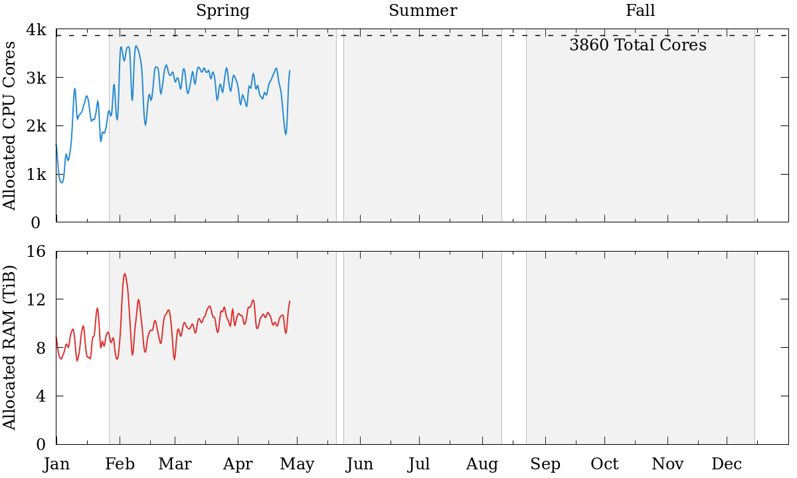
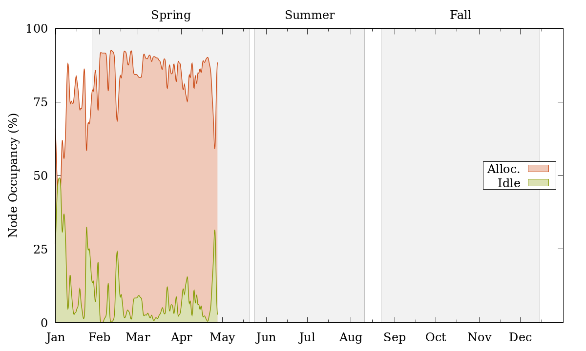
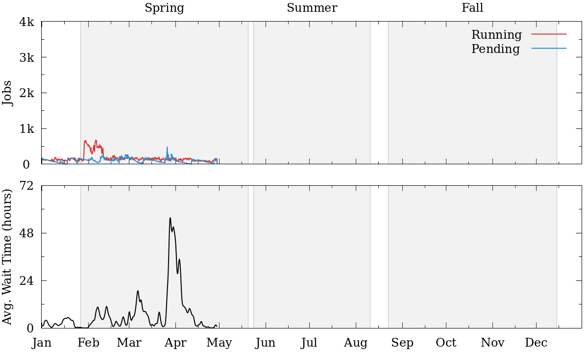
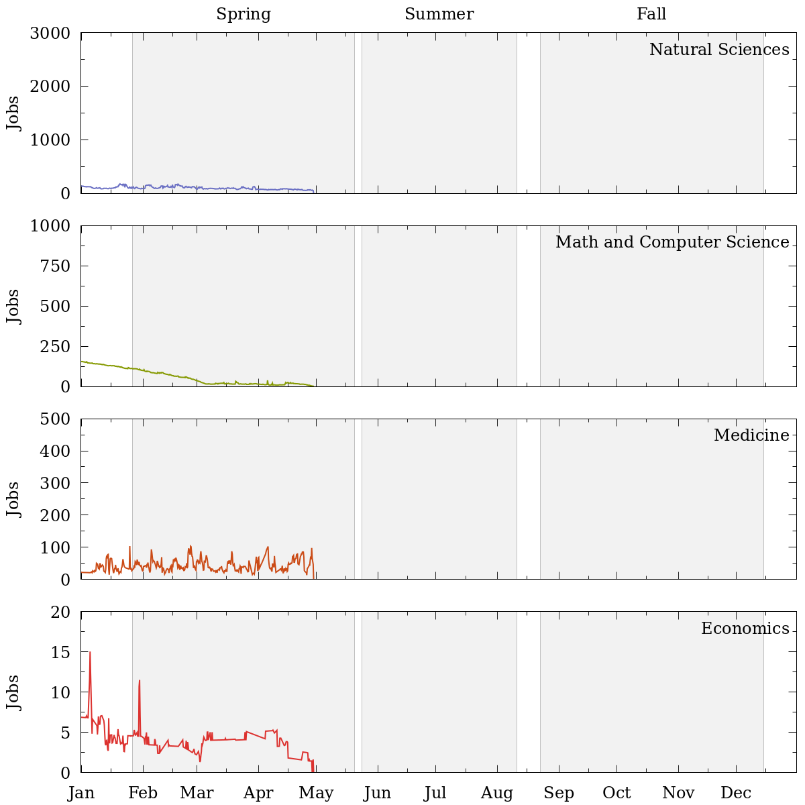
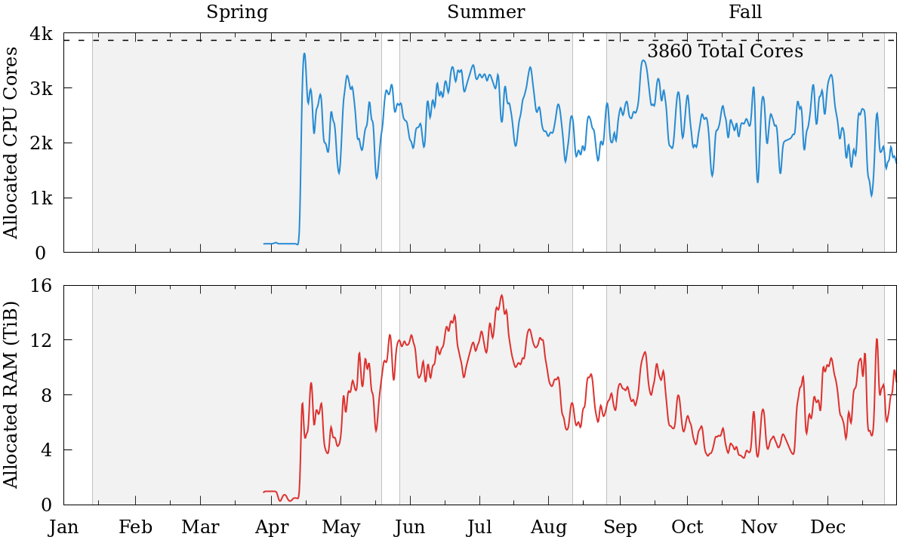
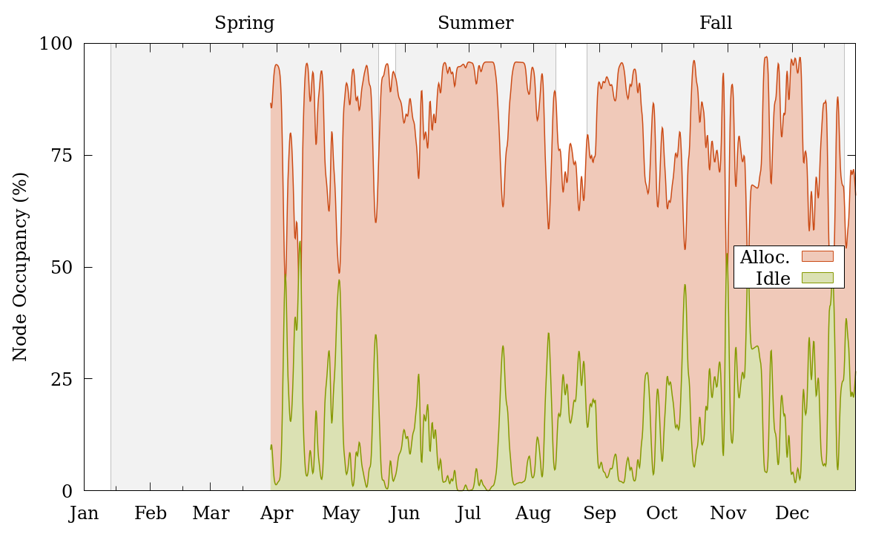
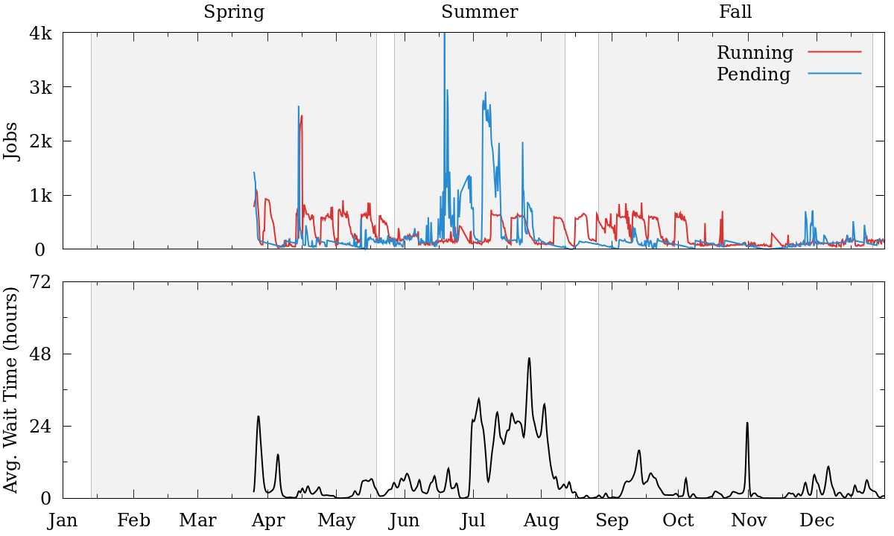
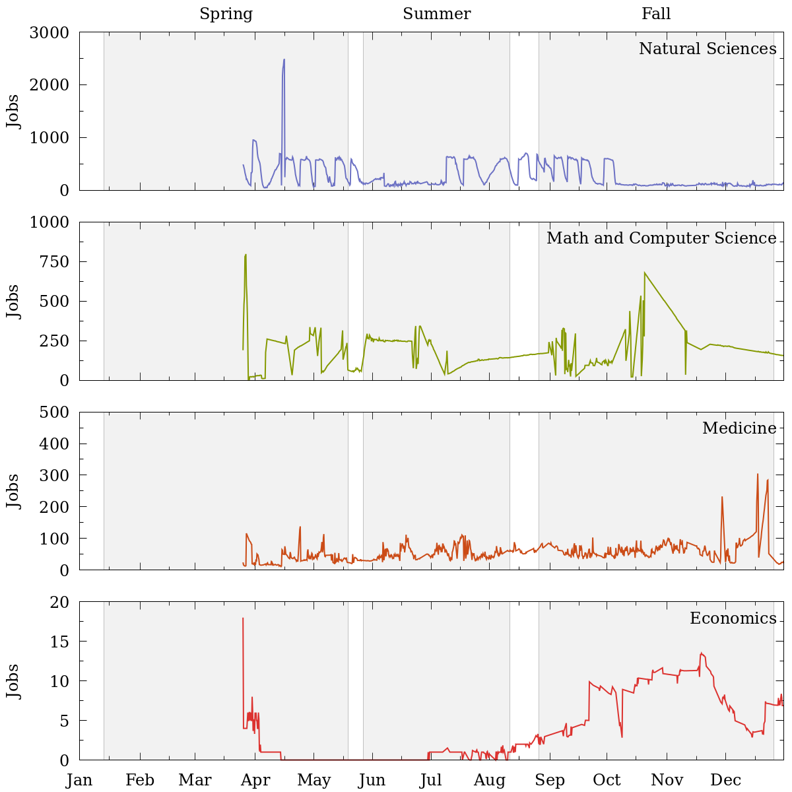

.. sec.stats:

===================================
Cluster Resource and Job Statistics
===================================

.. contents::
   :depth: 3
..
.. #############################################################################
.. #############################################################################
.. #############################################################################
.. #############################################################################

.. sec.stats.2021:

Statistics for 2021
===================

   Allocated CPU Cores (top panel) and RAM (in TiB, bottom panel) for the DEAC
   cluster, from January 2021 to the present.

|

   Occupancy state of the nodes in the DEAC cluster, from January 2021 to the
   present. Allocated nodes have resources being utilized, while Idle nodes do
   not.

|

   User job submission on the DEAC cluster, from January 2021 to the present.
   Top panel: running and pending jobs; bottom panel: average wait time for
   running jobs.

|

   Jobs per department discipline on the DEAC cluster, from January 2021 to
   the present.

.. #############################################################################
.. #############################################################################
.. #############################################################################
.. #############################################################################

.. sec.stats.2020:

Statistics for 2020
===================

   Allocated CPU Cores (top panel) and RAM (in TiB, bottom panel) for the DEAC
   cluster, from March 2020 through December 2020.

|

   Occupancy state of the nodes in the DEAC cluster, from March 2020 through
   December 2020. Allocated nodes have resources being utilized, while Idle
   nodes do not.

|

   User job submission on the DEAC cluster, from March 2020 through December
   2020. Top panel: running and pending jobs; bottom panel: average wait time
   for running jobs.

|

   Jobs per department discipline on the DEAC cluster, from March 2020 through
   December 2020.
